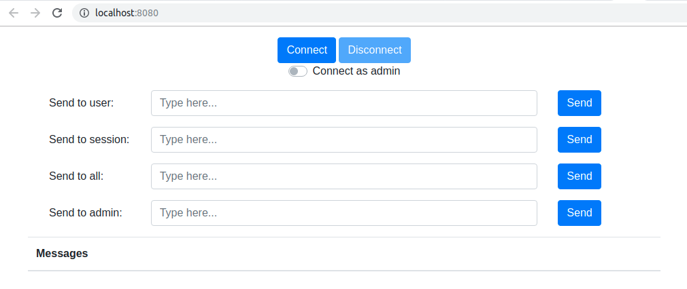

# WebSocket Demo
WebSockets demo application using Spring Boot  
Demo is working but it's still in progress

## Description
It allow you to send echo messages to:  
1. Same session (same tab in browser)
2. All sessions of user you have login
3. All sessions of all users    

Also you can login as normal user or as administrator  
Only administrator can send messages to 'admin' topic 

## Requirements
1. Java 8
2. Maven
3. Git

## Installation
1. Clone repository
2. Run project from root folder of application:
```
mvn spring-boot:run
```
3. Go to [**localhost:8080**](http://localhost:8080) in browser to see home page of application

## How to use
When you opened home page you will see something like this:  

Switch "Connect as admin" allows you to choose STOMP endpoints:  
* If it's OFF you will be connected to STOMP endpoint that requires USER rights  
* If it's ON you will need ADMIN rights  

"Connect" button allows you to create socket connection  
"Disconnect" button used to destroy connection  

When you press connect button browser will asked you for credentials  
Default user credentials are:  
- username: user  
- password: userpassword  
Default admin credentials are:  
- username: admin  
- password: adminpassword  
You can check or change it in net.evgenibers.wsd.services.security.MockedUserDetailsService  

After that you can send echo messages to different topics (user, session, all, admin)  
Received messages will be shown in the table "Messages"  
Message template is: <date-time> <username>: <message_text>  

## See also
https://spring.io/guides/gs/messaging-stomp-websocket  
https://www.baeldung.com/spring-security-websockets  
https://www.baeldung.com/spring-websockets-sendtouser  
http://jmesnil.net/stomp-websocket/doc/  
https://docs.spring.io/spring-security/site/docs/5.2.x/reference/html/web-app-security.html#websocket  
